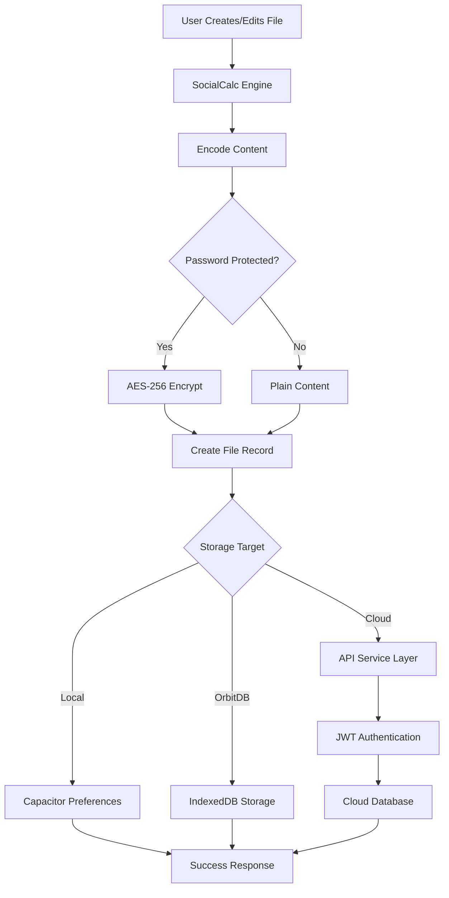
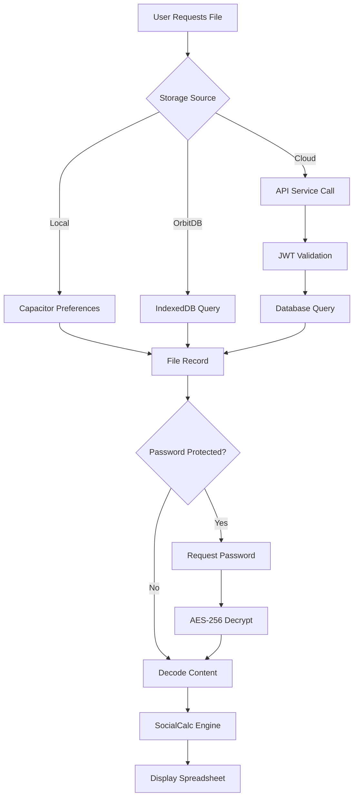
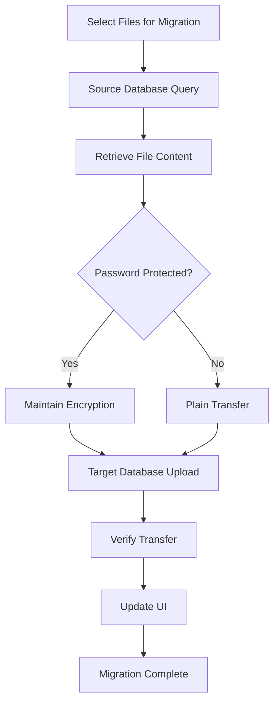

# Database Architecture Documentation

This document provides comprehensive documentation for all database storage systems and data management mechanisms in the Government Billing Solution MVP.

## Overview

The Government Billing Solution MVP implements a **unified multi-database architecture** supporting 6 different storage systems with a common API interface. This design provides flexibility, redundancy, and allows users to choose the most appropriate storage solution for their needs.

## Supported Database Systems

### 1. Local Storage (Capacitor Preferences)
- **Type**: Client-side encrypted storage
- **Implementation**: Capacitor Preferences API
- **Primary Use**: Default local storage, offline functionality
- **Encryption**: AES-256 encryption using CryptoJS

### 2. OrbitDB (IndexedDB)
- **Type**: Decentralized peer-to-peer database
- **Implementation**: Browser IndexedDB (simplified OrbitDB-like service)
- **Primary Use**: Local decentralized storage
- **Encryption**: Client-side encryption support

### 3. AWS S3
- **Type**: Cloud object storage
- **Implementation**: Server-side API integration
- **Primary Use**: Production cloud storage
- **Encryption**: Server-side encryption

### 4. PostgreSQL
- **Type**: Relational database
- **Implementation**: Server-side API integration
- **Primary Use**: Structured data storage
- **Encryption**: Server-side encryption

### 5. Firebase Storage
- **Type**: Google Cloud storage
- **Implementation**: Server-side API integration
- **Primary Use**: Real-time synchronization
- **Encryption**: Server-side encryption

### 6. MongoDB
- **Type**: NoSQL document database
- **Implementation**: Server-side API integration
- **Primary Use**: Flexible document storage
- **Encryption**: Server-side encryption

### 7. Neo4j
- **Type**: Graph database
- **Implementation**: Server-side API integration
- **Primary Use**: Complex relationship data
- **Encryption**: Server-side encryption

## Data Structure and Schema

### Universal File Record Structure

All database systems use a consistent file record structure:

```typescript
interface FileRecord {
    fileName: string;           // Unique file identifier
    fileContent: string;        // File content (encrypted if protected)
    isPasswordProtected: boolean; // Protection flag
    created_at: string;         // ISO timestamp of creation
    modified_at: string;        // ISO timestamp of last modification
    billType?: number;          // Invoice template type (1-4)
    password?: string;          // Cached password for protected files
}
```

### File List Response Structure

```typescript
interface FileListResponse {
    files: { [fileName: string]: number };               // Regular files with timestamps
    passwordProtectedFiles: { [fileName: string]: number }; // Protected files with timestamps
}
```

### Content Storage Format

#### SocialCalc Spreadsheet Data
Files are stored as encoded SocialCalc spreadsheet data containing:
- Cell definitions with formulas, formatting, and values
- Sheet metadata (dimensions, borders, fonts)
- Multiple sheet support for workbooks
- Invoice template configurations

Example structure:
```
version:1.5
cell:A2:b::2:::l:1:f:7
cell:B2:t:INVOICE:b:1:1:1:1:f:6:cf:1:colspan:6
...
col:A:w:10
row:1:h:14.25
sheet:c:7:r:36:h:12.75
border:1:1px solid rgb(0,0,0)
cellformat:1:center
font:1:* * Trebuchet MS
```

## Storage Implementation Details

### 1. Local Storage (Capacitor Preferences)

**File**: `src/components/Storage/LocalStorage.ts`

#### Key Features:
- **AES-256 Encryption**: Files are encrypted client-side before storage
- **Password Protection**: Two-tier protection with file-level passwords
- **Capacitor Integration**: Cross-platform storage for web and mobile
- **Backward Compatibility**: Supports legacy "Protected_" prefix format

#### Storage Process:
1. File content is URI-encoded for safe storage
2. If password-protected, content is encrypted using AES-256
3. File metadata is stored with Capacitor Preferences
4. Encryption key is derived from user-provided password

#### Encryption Implementation:
```typescript
// Encryption
const encrypted = CryptoJS.AES.encrypt(content, password).toString();

// Decryption with backward compatibility
let actualEncryptedContent = encryptedContent;
if (encryptedContent.startsWith('Protected_')) {
    actualEncryptedContent = encryptedContent.substring(10);
}
const decrypted = CryptoJS.AES.decrypt(actualEncryptedContent, password);
```

#### Data Location:
- **Web**: Browser's native storage (localStorage)
- **Mobile**: Platform-specific secure storage (Keychain/Keystore)

### 2. OrbitDB (IndexedDB Implementation)

**File**: `src/services/OrbitDBService.ts`

#### Key Features:
- **Simplified P2P Storage**: Uses IndexedDB to simulate OrbitDB functionality
- **Object Store Structure**: Files stored in structured object store
- **Indexed Access**: Supports indexing by creation time, modification time, and protection status
- **Singleton Pattern**: Single instance across application

#### Database Configuration:
```typescript
Database Name: 'OrbitDB-Files'
Version: 1
Object Store: 'files'
Key Path: 'fileName'

Indexes:
- 'created_at': Non-unique index for temporal queries
- 'modified_at': Non-unique index for temporal queries  
- 'isPasswordProtected': Non-unique index for security filtering
```

#### CRUD Operations:
- **Create/Update**: `put()` operation with automatic timestamp updates
- **Read**: `get()` operation by fileName key
- **List**: `getAll()` with filtering by protection status
- **Delete**: `delete()` operation by fileName key

#### Storage Process:
1. Initialize IndexedDB with schema creation
2. Store FileRecord objects with structured metadata
3. Handle password protection at application level
4. Maintain temporal indexes for efficient querying

### 3. Cloud Database Systems (S3, PostgreSQL, Firebase, MongoDB, Neo4j)

All cloud database systems follow a unified server-side API pattern:

#### Authentication:
- **JWT Token**: Required for all operations
- **User Scoping**: Files are user-specific based on token
- **Session Management**: Automatic token validation

#### Common Operations:

##### Upload File:
```http
POST /api/v1/uploadFile{Database}
Content-Type: application/json

{
    "fileName": "string",
    "fileContent": "string", 
    "isPasswordProtected": "boolean",
    "token": "string"
}
```

##### List Files:
```http
POST /api/v1/listAll{Database}
Content-Type: application/json

{
    "token": "string"
}
```

##### Get File:
```http  
POST /api/v1/getFile{Database}
Content-Type: application/json

{
    "fileName": "string",
    "isPasswordProtected": "boolean",
    "token": "string"
}
```

##### Delete File:
```http
POST /api/v1/deleteFile{Database}
Content-Type: application/json

{
    "fileName": "string", 
    "isPasswordProtected": "boolean",
    "token": "string"
}
```

#### Database-Specific Implementations:

**AWS S3:**
- Files stored as objects with user-prefixed keys
- Metadata stored in object tags
- Server-side encryption enabled
- Conflict resolution for concurrent uploads

**PostgreSQL:**
- Structured table with columns for file metadata
- JSONB column for file content
- B-tree indexes on fileName and user_id
- ACID compliance for data integrity

**Firebase Storage:**
- Hierarchical path structure: `/users/{userId}/files/{fileName}`
- Real-time database for metadata
- Cloud Functions for server-side processing
- Automatic scaling and CDN distribution

**MongoDB:**
- Document-based storage with user collections
- GridFS for large file content
- Compound indexes on userId and fileName
- Replica set for high availability

**Neo4j:**
- Graph nodes for users and files
- Relationships track file ownership and metadata
- Cypher queries for complex file relationships
- ACID transactions for graph consistency

## Data Flow Architecture

### File Upload Flow



### File Retrieval Flow



### Cross-Database Migration Flow



## Security Architecture

### Encryption Strategy

#### Client-Side Encryption (Local Storage):
- **Algorithm**: AES-256 in CBC mode
- **Key Derivation**: Direct password-based encryption
- **Salt**: Implicit in CryptoJS implementation
- **Backward Compatibility**: Supports legacy "Protected_" prefix

#### Server-Side Encryption (Cloud Databases):
- **Transport**: HTTPS/TLS encryption for all API calls
- **Authentication**: JWT token validation
- **Authorization**: User-scoped data access
- **Storage**: Database-specific encryption at rest

### Password Protection Levels

1. **Unprotected Files**: Stored as plain encoded content
2. **Password-Protected Files**: AES-256 encrypted with user password
3. **Cloud Storage**: Additional server-side security measures

### Security Best Practices

- **No Plain Text Passwords**: Passwords never stored in plain text
- **Token Expiration**: JWT tokens have limited lifespan
- **User Isolation**: Files are strictly user-scoped
- **Audit Trail**: All operations logged for security monitoring
- **Input Validation**: All user inputs validated and sanitized

## Performance Considerations

### Local Storage Optimization
- **Lazy Loading**: Files loaded on demand
- **Compression**: Content encoded for size efficiency
- **Caching**: Recent files cached in memory
- **Background Sync**: Non-blocking cloud synchronization

### Database-Specific Optimizations

**IndexedDB (OrbitDB):**
- Indexed queries for fast file listing
- Batch operations for multiple file handling
- Transaction-based updates for consistency

**Cloud Databases:**
- Connection pooling for API efficiency
- Batch upload/download operations
- Conflict resolution for concurrent access
- CDN integration for global distribution

### Memory Management
- **Content Streaming**: Large files processed in chunks
- **Garbage Collection**: Automatic cleanup of temporary objects
- **Resource Pooling**: Shared connections and contexts

## Error Handling and Recovery

### Local Storage Errors
- **Quota Exceeded**: Graceful degradation with user notification
- **Corruption**: Automatic backup restoration
- **Encryption Errors**: Password validation and retry mechanisms

### Cloud Database Errors
- **Network Failures**: Automatic retry with exponential backoff
- **Authentication Errors**: Token refresh and re-authentication
- **Server Errors**: Fallback to alternative storage systems

### Data Consistency
- **Atomic Operations**: All-or-nothing file operations
- **Version Control**: Timestamp-based conflict resolution
- **Backup Strategies**: Multiple storage system redundancy

## Migration and Interoperability

### Cross-Database Migration
The system supports seamless file migration between any database systems:

1. **Source Validation**: Verify file existence and accessibility
2. **Content Retrieval**: Fetch file with encryption status
3. **Target Upload**: Upload to destination with same protection level
4. **Verification**: Confirm successful transfer
5. **Cleanup**: Optional source file removal

### Data Portability
- **Export Formats**: PDF, CSV, native SocialCalc format
- **Import Compatibility**: Multiple spreadsheet formats supported
- **Backup Solutions**: Full database export/import capabilities

### Version Compatibility
- **Schema Evolution**: Backward compatible data structures
- **Legacy Support**: Handles older file formats gracefully
- **Upgrade Paths**: Smooth migration between application versions

## Monitoring and Analytics

### Performance Metrics
- **Response Times**: API call latency tracking
- **Success Rates**: Operation success/failure ratios
- **Storage Usage**: Per-user and system-wide storage consumption
- **Error Rates**: Database-specific error frequency

### Usage Analytics
- **Database Preferences**: User storage system choices
- **File Operations**: CRUD operation frequency
- **Migration Patterns**: Cross-database transfer statistics
- **Security Events**: Password protection usage

### Health Monitoring
- **Database Connectivity**: Real-time connection status
- **Service Availability**: Uptime tracking for each storage system
- **Resource Utilization**: Memory and storage usage monitoring
- **Alert Systems**: Automated notifications for system issues

## Configuration and Environment Variables

### API Configuration
Located in `src/config/environment.ts`:

```typescript
interface EnvironmentConfig {
    API_BASE_URL: string;     // Backend API endpoint
    APP_NAME: string;         // Application identifier
    ENVIRONMENT: string;      // Development/production mode
    GMAIL_API_KEY: string;    // Email integration
    GMAIL_CLIENT_ID: string;  // Email authentication
}
```

### Database-Specific Configuration
Each cloud database system has its own configuration requirements managed server-side:

- **AWS S3**: Bucket configuration, IAM roles, CORS settings
- **PostgreSQL**: Connection strings, pool sizes, SSL settings
- **Firebase**: Project configuration, service account keys
- **MongoDB**: Cluster configuration, authentication settings
- **Neo4j**: Database URI, authentication credentials

### Local Storage Configuration
- **Encryption Settings**: Default algorithms and key sizes
- **Storage Quotas**: Maximum file sizes and counts
- **Backup Policies**: Automatic backup frequency and retention

## Troubleshooting and Diagnostics

### Common Issues

#### Local Storage Problems:
- **Solution**: Clear browser data, check storage quotas
- **Prevention**: Implement storage usage monitoring

#### Cloud Database Connectivity:
- **Solution**: Verify API endpoints, check authentication tokens
- **Prevention**: Health check endpoints and automatic failover

#### Encryption/Decryption Errors:
- **Solution**: Validate passwords, check file integrity
- **Prevention**: Strong password validation and file checksums

### Diagnostic Tools
- **Console Logging**: Detailed operation logs for debugging
- **Error Reporting**: Structured error messages with context
- **Health Checks**: API endpoint status verification
- **Performance Profiling**: Operation timing and resource usage

### Recovery Procedures
- **Local Storage Recovery**: Backup restoration from cloud storage
- **Cloud Data Recovery**: Cross-database backup systems
- **Corruption Handling**: File integrity verification and repair

## Future Enhancements

### Planned Database Support
- **Redis**: High-performance caching layer
- **Elasticsearch**: Full-text search capabilities
- **Cassandra**: Distributed database scaling
- **TimescaleDB**: Time-series data optimization

### Advanced Features
- **Real-time Collaboration**: Multi-user editing capabilities
- **Conflict Resolution**: Advanced merge strategies
- **Automated Backups**: Scheduled cross-database synchronization
- **Data Analytics**: Advanced usage pattern analysis

### Performance Improvements
- **Database Sharding**: Horizontal scaling strategies
- **CDN Integration**: Global content distribution
- **Compression**: Advanced file compression algorithms
- **Streaming**: Large file handling optimization

This documentation provides a comprehensive overview of the database architecture in the Government Billing Solution MVP. The unified multi-database approach ensures flexibility, reliability, and scalability while maintaining a consistent user experience across all storage systems.
