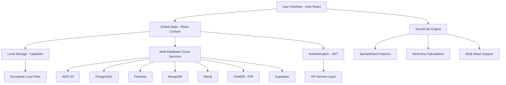

# Government Billing Solution MVP

<div align="center">


**A comprehensive cross-platform billing and invoicing application built with Ionic React, featuring advanced spreadsheet functionality, multi-database cloud integration, and enterprise-grade security.**

[📱 Features](#-features) • [🚀 Quick Start](#-quick-start) • [💻 Development](#-development) • [🔧 Architecture](#-architecture) • [📚 Documentation](#-documentation)

</div>

---

## 🌟 **Overview**

The Government Billing Solution MVP is a modern, cross-platform application designed specifically for government billing operations. Built with Ionic React and TypeScript, it provides a robust spreadsheet interface powered by **SocialCalc** with advanced features including multi-database cloud storage, password protection, barcode generation, and real-time collaboration capabilities.

### **Why Choose This Solution?**

- 🏛️ **Government-Ready**: Designed specifically for government billing workflows with multiple invoice templates
- 🔒 **Enterprise Security**: AES-256 encryption, JWT authentication, and password-protected files
- 📱 **Cross-Platform**: Single codebase for Web, Android, and iOS using Ionic Capacitor
- ☁️ **Multi-Cloud Support**: Integrated support for 6 different databases/storage systems
- 🚀 **Performance-Optimized**: Fast loading, auto-save, and responsive interface
- 📊 **Advanced Spreadsheet**: Custom SocialCalc engine with real-time calculations and professional formatting

---

## ✨ **Core Features**

### 📊 **Advanced Spreadsheet Engine**
- **SocialCalc Integration**: Custom-enhanced spreadsheet engine optimized for billing and invoicing
- **Multiple Invoice Templates**: 4 pre-built government invoice templates (Type I-IV)
- **Real-time Calculations**: Live formula calculations with automatic totals and tax computations
- **Undo/Redo System**: Comprehensive edit history with keyboard shortcuts (Ctrl+Z/Ctrl+Y)
- **Professional Formatting**: Advanced cell formatting, styling, borders, and layout options
- **Multi-Sheet Support**: Workbook functionality with sheet navigation and management
- **Editable Cell Control**: Configurable editable regions for different invoice types

### 🔐 **Security & Authentication**
- **JWT Token Authentication**: Secure, stateless authentication with automatic refresh
- **AES-256 File Encryption**: Industry-standard encryption for sensitive documents
- **Password-Protected Files**: Secure file protection with visual shield indicators
- **Session Management**: Automatic token validation and secure logout
- **Local Storage Encryption**: Encrypted local file storage using Capacitor Preferences
- **Access Control**: Role-based permissions and secure API communications

### ☁️ **Multi-Database Cloud Integration**
- **AWS S3 Storage**: Primary cloud storage with batch operations and conflict resolution
- **PostgreSQL Integration**: Relational database support for structured data
- **Firebase Storage**: Google Cloud integration for real-time synchronization
- **MongoDB Support**: NoSQL database for flexible document storage
- **Neo4j Integration**: Graph database support for complex relationship data
- **OrbitDB (P2P)**: Decentralized, peer-to-peer database using IndexedDB locally
- **Unified API**: Single interface for all database operations (CRUD, batch, migration)
- **Cross-Database Migration**: Seamless file migration between different storage systems

### 📄 **Export & Document Management**
- **PDF Export**: High-quality PDF generation with custom layouts and professional formatting
- **Multi-Sheet PDF**: Export entire workbooks with all sheets in a single PDF
- **CSV Export**: Excel-compatible CSV with UTF-8 support and data validation
- **MSC Format**: Native SocialCalc format for full fidelity preservation
- **Email Integration**: 
  - Gmail API integration for direct email sending
  - Multiple attachment formats (PDF, CSV, MSC)
  - Mobile email sharing via native share dialogs
  - Fallback email methods for compatibility
- **Print Support**: Direct printing with layout optimization for different paper sizes

### 🔍 **File Management & Search**
- **Local File Storage**: Encrypted local storage with auto-save functionality
- **Cloud File Management**: Upload, download, edit, delete operations across all supported databases
- **Real-time Search**: Instant filtering across local and cloud files with case-insensitive matching
- **File Conflict Resolution**: Smart handling of naming conflicts and version management
- **Batch Operations**: Select multiple files for upload, download, or migration
- **Password Protection Indicators**: Visual indicators for encrypted files
- **File Metadata**: Creation/modification timestamps and file type information

### 📱 **Mobile & Cross-Platform Features**
- **Camera Integration**: Direct photo capture for logo insertion via device camera
- **Photo Library Access**: Import images from device gallery
- **Barcode/QR Code Generation**: Create shareable QR codes linking to cloud-stored documents
- **Barcode Scanning**: Scan QR codes to load remote spreadsheets (camera or photo library)
- **Native Share Dialogs**: Platform-specific sharing options on mobile devices
- **Touch-Optimized UI**: Mobile-friendly interface with gesture support
- **Offline Capability**: Full functionality without internet connection

### ⚡ **Auto-Save & Performance**
- **Intelligent Auto-Save**: 3-second debounced auto-save with retry logic
- **Save Status Indicators**: Real-time save status with progress feedback
- **Performance Monitoring**: Load time tracking and optimization
- **Memory Management**: Efficient handling of large spreadsheets
- **Background Processing**: Non-blocking operations for file operations
- **Crash Recovery**: Automatic recovery of unsaved work

### 🖼️ **Logo & Branding Management**
- **Cloud Logo Storage**: Secure logo upload and CDN delivery
- **Device-Adaptive Placement**: Logo positioning optimized for different device types
- **Real-time Integration**: Immediate logo placement in spreadsheet headers
- **Image Processing**: Automatic image optimization and format conversion

### 🔧 **Developer & Admin Features**
- **Error Boundary**: Comprehensive error handling and user feedback
- **Debug Console**: Development tools and performance monitoring
- **Environment Configuration**: Flexible environment setup for different deployments
- **API Health Checks**: System status monitoring and diagnostics
- **Comprehensive Logging**: Detailed logging for debugging and maintenance

---

## 🚀 **Quick Start**

### **Prerequisites**

- **Node.js** 18+ and npm
- **TypeScript** 5.1+
- **Android Studio** (for Android development)
- **Xcode** (for iOS development, macOS only)

### **Installation**

```bash
# Clone the repository
git clone <repository-url>
cd Govt-billing-solution-MVP

# Install dependencies
npm install

# Set up environment variables
cp .env.example .env
# Edit .env with your configuration
```

### **Environment Configuration**

Create a `.env` file with the following variables:

```env
# API Configuration
VITE_API_BASE_URL=https://your-api-server.com
VITE_APP_NAME="Government Billing Solution"
VITE_ENVIRONMENT=development

# Gmail API (for email features)
VITE_GMAIL_API_KEY=your-gmail-api-key
VITE_GMAIL_CLIENT_ID=your-gmail-client-id

# AWS S3 Configuration (optional)
VITE_REGION=us-east-1
VITE_BUCKET=your-s3-bucket-name
VITE_ACCESS_KEY=your-aws-access-key
VITE_SECRET_KEY=your-aws-secret-key

# Auto-save Configuration
VITE_AUTO_SAVE_ENABLED=true
VITE_AUTO_SAVE_INTERVAL=3000
```

### **Development Server**

```bash
# Start development server
npm run dev

# The app will be available at http://localhost:5173
```

### **Production Build**

```bash
# Type checking
npm run type-check

# Run tests
npm run test

# Build for production
npm run build:prod

# Preview production build
npm run serve
```

### **Mobile Development**

```bash
# Build for Android
npm run build:android

# Open Android Studio
npm run android

# Build for iOS (macOS only)
# npm run build:ios
# npm run ios
```

---

## 💻 **Development**

### **Available Scripts**

```bash
# Development
npm run dev              # Start development server
npm run type-check       # TypeScript type checking
npm run lint             # ESLint code linting
npm run lint:fix         # Auto-fix linting issues

# Testing
npm run test             # Run all tests (type-check + unit tests)
npm run test.unit        # Vitest unit tests
npm run test.e2e         # Cypress end-to-end tests

# Building
npm run build            # Development build
npm run build:prod       # Production build with optimizations
npm run clean            # Clean build artifacts

# Mobile Development
npm run build:android    # Build and sync for Android
npm run android          # Open Android Studio

# Analysis & Tools
npm run analyze          # Bundle size analysis
npm run generate-pwa-assets  # Generate PWA assets
```

### **Project Structure**

```
src/
├── components/           # Reusable UI components
│   ├── Cloud/           # Multi-database cloud storage integration
│   ├── Files/           # Local file management
│   ├── Login/           # Authentication components
│   ├── Menu/            # Action menu with all app features
│   ├── NewFile/         # New file creation dialog
│   ├── FooterSelector/  # Sheet navigation component
│   ├── PasswordModal/   # Password input for protected files
│   ├── Storage/         # Local storage utilities and encryption
│   ├── socialcalc/      # Enhanced SocialCalc spreadsheet engine
│   └── service/         # API service layer
├── contexts/            # React Context providers
│   └── AppContext.tsx   # Global application state
├── pages/              # Main application pages
│   └── Home.tsx        # Primary spreadsheet interface
├── services/           # Export and utility services
│   ├── exportAsPdf.ts  # PDF generation
│   ├── exportAsCsv.ts  # CSV export
│   ├── gmailService.ts # Gmail API integration
│   └── OrbitDBService.ts # P2P database service
├── config/             # Configuration files
│   ├── environment.ts  # Environment variables
│   └── autosave.config.ts # Auto-save settings
└── theme/              # Ionic styling and custom themes
```

### **Technology Stack**

- **Frontend**: Ionic React 7.0+ with TypeScript
- **Build Tool**: Vite 5.0+ with legacy browser support
- **Mobile**: Capacitor 5.7+ for cross-platform deployment
- **Spreadsheet**: Custom SocialCalc integration with advanced features
- **Authentication**: JWT with server-side validation
- **Storage**: Multi-database support (S3, PostgreSQL, Firebase, MongoDB, Neo4j, OrbitDB)
- **Encryption**: CryptoJS for AES-256 encryption
- **HTTP Client**: Axios with interceptors and error handling
- **Testing**: Vitest (unit), Cypress (e2e)
- **Code Quality**: ESLint, TypeScript strict mode

---

## 🔧 **Architecture**

### **Application Architecture**



### **Security Architecture**

- **Client-Side Encryption**: AES-256 encryption for sensitive files before cloud storage
- **Token-Based Authentication**: JWT tokens with automatic refresh and validation
- **Secure Local Storage**: Encrypted storage via Capacitor Preferences
- **API Security**: All cloud operations require valid authentication tokens
- **Data Protection**: No sensitive data stored in plain text anywhere
- **Cross-Platform Security**: Consistent security model across web and mobile

### **Database Integration Architecture**

The application features a unified database abstraction layer supporting 7 different storage systems:

1. **AWS S3**: Primary cloud storage for production use
2. **PostgreSQL**: Structured relational data storage
3. **Firebase**: Real-time synchronization and Google Cloud integration
4. **MongoDB**: Flexible document-based storage
5. **Neo4j**: Graph database for complex relationships
6. **OrbitDB**: Decentralized P2P storage using IndexedDB
7. **Supabase**: Open-source Firebase alternative with PostgreSQL power

All databases use the same API interface for consistent operations:
- `listAllFiles()` - Get file listings with metadata
- `getFile()` - Retrieve file content with encryption support
- `uploadFile()` - Store files with optional password protection
- `deleteFile()` - Remove files from storage
- **Cross-Database Migration**: Move files between different storage systems

### **Performance Optimizations**

- **Code Splitting**: Lazy loading of components and heavy dependencies
- **Memory Management**: Efficient undo/redo stack with configurable limits
- **Auto-Save Optimization**: Debounced saves with retry logic and status feedback
- **Caching Strategy**: Smart caching for cloud files and metadata
- **Bundle Optimization**: Tree shaking and compression for smaller builds
- **Mobile Performance**: Native performance through Capacitor with minimal overhead

---

## 📚 **Usage Guide**

### **Getting Started**

1. **Launch the Application**: Open in web browser or mobile device
2. **Create Your First Invoice**: Start with one of the 4 built-in templates
3. **Edit Content**: Click on editable cells to input your billing information
4. **Save Your Work**: Use auto-save or manual save options
5. **Export or Share**: Generate PDFs, CSVs, or share via email

### **Authentication & Cloud Storage**

1. **Sign In**: Click the login button and authenticate with your credentials
2. **Cloud Access**: Once authenticated, access cloud storage via the cloud icon
3. **Upload Files**: Save invoices to multiple cloud databases
4. **Cross-Platform Sync**: Access your files from any device
5. **Migration**: Move files between different storage systems as needed

### **Advanced Features**

- **Password Protection**: Save sensitive invoices with encryption
- **Barcode Generation**: Create QR codes for easy invoice sharing
- **Logo Management**: Add company logos via camera or photo library
- **Multi-Sheet Invoices**: Create complex invoices with multiple sheets
- **Batch Operations**: Select multiple files for bulk operations

---

## 📱 **Mobile Features**

### **Native Capabilities**
- **Camera Integration**: Direct photo capture for logos and barcode scanning
- **File Sharing**: Native share dialogs for documents and links
- **Offline Mode**: Full functionality without internet connection
- **Touch Optimization**: Mobile-friendly interface with gesture support
- **Background Auto-Save**: Automatic saving when app goes to background

### **Cross-Platform Consistency**
- **Unified Interface**: Identical features across web and mobile
- **Responsive Design**: Adaptive layouts for different screen sizes
- **Performance**: Native-level performance on mobile devices

---

## 🔧 **Configuration**

### **Auto-Save Settings**

```typescript
// src/config/autosave.config.ts
export default {
    DEBOUNCE_DELAY: 3000,        // 3 seconds after last edit
    MIN_SAVE_INTERVAL: 5000,     // Minimum 5 seconds between saves
    MAX_RETRY_ATTEMPTS: 3,       // Retry failed saves 3 times
    RETRY_DELAY: 2000,          // 2 seconds between retries
    EXCLUDED_FILES: ['default'], // Files to exclude from auto-save
    SAVED_STATUS_DURATION: 2000, // Show "saved" status for 2 seconds
    ERROR_STATUS_DURATION: 5000  // Show error status for 5 seconds
};
```

### **Environment Variables**

All configuration is handled through environment variables prefixed with `VITE_` for Vite compatibility.

---

## 🤝 **Contributing**

1. Fork the repository
2. Create a feature branch (`git checkout -b feature/amazing-feature`)
3. Commit your changes (`git commit -m 'Add amazing feature'`)
4. Push to the branch (`git push origin feature/amazing-feature`)
5. Open a Pull Request

### **Development Guidelines**

- Follow TypeScript strict mode requirements
- Use ESLint for code formatting
- Write unit tests for new features
- Update documentation for API changes
- Test on multiple devices and browsers

---

## 📄 **License**

This project is licensed under the MIT License - see the [LICENSE](LICENSE) file for details.

---

## 🆘 **Support**

For issues, questions, or contributions, please:

1. Check the [existing issues](../../issues)
2. Create a new issue with detailed information
3. Provide steps to reproduce any bugs
4. Include system information (OS, browser, device)

---

## 🙏 **Acknowledgments**

- **SocialCalc** - Powerful spreadsheet engine
- **Ionic Framework** - Cross-platform mobile development
- **React** - Modern UI framework
- **Capacitor** - Native mobile bridge
- **TypeScript** - Type-safe development

---

<div align="center">

**Built with ❤️ for Government Billing Solutions**

*Empowering efficient government operations through modern technology*

</div>