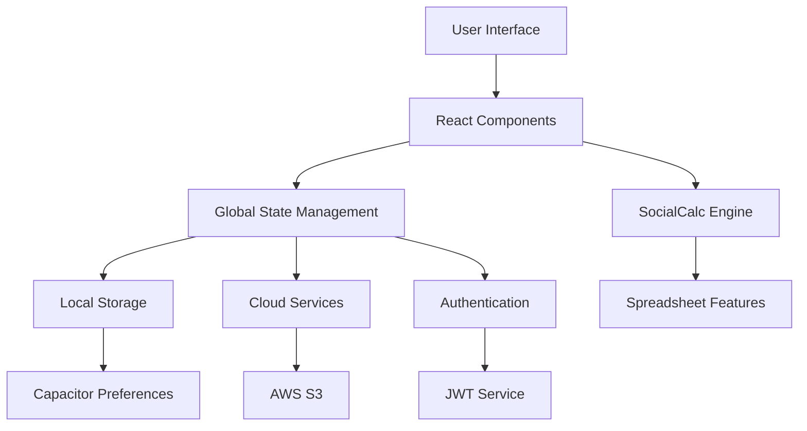

# Government Billing Solution MVP

<div align="center">


**A comprehensive cross-platform billing and invoicing application built with Ionic React, featuring advanced spreadsheet functionality, cloud integration, and enterprise-grade security.**

[📱 Features](#-features) • [🚀 Quick Start](#-quick-start) • [💻 Development](#-development) • [📚 Documentation](#-documentation) • [🔧 Architecture](#-architecture)

</div>

---

## 🌟 **Overview**

The Government Billing Solution MVP is a modern, cross-platform application designed specifically for government billing operations. Built with Ionic React and TypeScript, it provides a robust spreadsheet interface with advanced features including cloud storage, password protection, and real-time collaboration capabilities.

### **Why Choose This Solution?**

- 🏛️ **Government-Ready**: Designed specifically for government billing workflows
- 🔒 **Enterprise Security**: AES encryption and JWT authentication
- 📱 **Cross-Platform**: Single codebase for Web, Android, and iOS
- ☁️ **Cloud-Native**: Built-in S3 integration
- 🚀 **Performance-Optimized**: Fast loading and responsive interface
- 🔧 **Developer-Friendly**: Well-documented with modern tech stack

---

## ✨ **Features**

### 📊 **Core Spreadsheet Engine**
- **Advanced SocialCalc Integration**: Custom-enhanced spreadsheet engine optimized for billing
- **Real-time Calculations**: Live formula calculations and data validation
- **Undo/Redo System**: 50-operation history with keyboard shortcuts (Ctrl+Z/Ctrl+Y)
- **Multiple Bill Types**: Support for various government billing formats
- **Professional Formatting**: Advanced cell formatting and styling options

### 🔐 **Security & Authentication**
- **JWT Token Authentication**: Secure, stateless authentication system
- **AES File Encryption**: Industry-standard encryption for sensitive documents
- **Password Protection**: Secure file protection with visual indicators
- **Session Management**: Automatic token refresh and secure logout
- **Access Control**: Role-based permissions and audit trails

### ☁️ **Cloud Storage Integration**
- **AWS S3 Support**: Secure file storage with batch operations
- **File Management**: Upload, download, search, and organize files
- **Conflict Resolution**: Smart handling of file conflicts
- **Offline Capability**: Local storage with cloud synchronization

### 📄 **Export & Sharing**
- **PDF Export**: High-quality PDF generation with custom layouts
- **Workbook PDF**: Multi-sheet export with professional formatting
- **CSV Export**: Excel-compatible CSV with UTF-8 support
- **Mobile Sharing**: Native share dialogs on mobile devices
- **Print Support**: Direct printing with layout optimization

### 🖼️ **Logo Management**
- **Device-Specific Positioning**: Adaptive logo placement per device type
- **Camera Integration**: Direct photo capture via device camera
- **Photo Library Access**: Import logos from device gallery
- **Cloud Upload**: Secure logo storage with CDN delivery
- **Real-time Integration**: Immediate logo placement in spreadsheets

### ⚡ **Auto-Save System**
- **Intelligent Debouncing**: 3-second delay after last edit
- **Retry Logic**: Automatic retry with configurable attempts
- **Status Indicators**: Real-time save status display
- **User Control**: Enable/disable with manual override
- **Performance Optimized**: Minimal impact on user experience

### 🔍 **Search & Navigation**
- **Real-time File Search**: Instant filtering across local and cloud files
- **Advanced Filtering**: Case-insensitive search with clear feedback
- **Multi-platform Search**: Unified search across S3
- **Quick Actions**: Search and immediately open/edit files
- **Mobile Optimized**: Touch-friendly search interface

---

## 🚀 **Quick Start**

### **Prerequisites**

- **Node.js** 18+ and npm
- **TypeScript** 5.1+
- **Android Studio** (for Android development)
- **Xcode** (for iOS development, macOS only)

### **Installation**

```bash
# Clone the repository
git clone https://github.com/your-org/govt-billing-solution-mvp.git
cd govt-billing-solution-mvp

# Install dependencies
npm install

# Set up environment variables
cp .env.example .env.local
# Edit .env.local with your configuration
```

### **Environment Configuration**

Create a `.env.local` file:

```env
# API Configuration
VITE_API_BASE_URL=https://your-api-server.com
VITE_APP_NAME=Government Billing Solution
VITE_ENVIRONMENT=development

# Cloud Storage (optional for development)
VITE_S3_BUCKET=your-s3-bucket
```

### **Development Server**

```bash
# Start development server
npm run dev

# Access at http://localhost:5173
```

### **Production Build**

```bash
# Type check
npm run type-check

# Run tests
npm run test

# Build for production
npm run build:prod

# Preview production build
npm run serve
```

---

## 💻 **Development**

### **Available Scripts**

```bash
# Development
npm run dev              # Start development server
npm run type-check       # TypeScript type checking
npm run lint             # Code linting
npm run lint:fix         # Auto-fix linting issues

# Testing
npm run test             # Run all tests
npm run test.unit        # Unit tests only
npm run test.e2e         # End-to-end tests

# Building
npm run build            # Development build
npm run build:prod       # Production build with optimizations
npm run clean            # Clean build artifacts

# Mobile Development
npm run build:android    # Build for Android
npm run android          # Open Android Studio
npm run build:ios        # Build for iOS (macOS only)
npm run ios              # Open Xcode (macOS only)

# Analysis
npm run analyze          # Bundle size analysis
npm run generate-pwa-assets  # Generate PWA assets
```

### **Project Structure**

```
src/
├── components/           # Reusable UI components
│   ├── Cloud/           # Cloud storage integration
│   ├── Files/           # File management
│   ├── Login/           # Authentication components
│   ├── Menu/            # Navigation and actions
│   ├── Storage/         # Local storage utilities
│   └── socialcalc/      # Spreadsheet engine
├── contexts/            # React Context providers
├── pages/               # Main application pages
├── services/            # Export and utility services
├── config/              # Configuration files
└── theme/               # Styling and themes
```

### **Technology Stack**

- **Frontend**: Ionic React 7.0+ with TypeScript
- **Build Tool**: Vite with legacy browser support
- **Mobile**: Capacitor 5.0+ for cross-platform deployment
- **Spreadsheet**: Custom SocialCalc integration
- **Authentication**: JWT with server validation
- **Storage**: Capacitor Preferences + Cloud APIs
- **Styling**: Ionic CSS Framework with custom themes

---

## 🔧 **Architecture**

### **Application Architecture**



### **Security Architecture**

- **Client-Side Encryption**: AES encryption for sensitive files
- **Token-Based Auth**: JWT tokens with automatic refresh
- **Secure Storage**: Encrypted local storage via Capacitor
- **API Security**: All cloud operations require authentication
- **Data Protection**: No sensitive data stored in plain text

### **Performance Optimizations**

- **Code Splitting**: Lazy loading of components and routes
- **Memory Management**: Efficient undo/redo stack management
- **Caching Strategy**: Smart caching for cloud files
- **Asset Optimization**: Compressed images and optimized bundles
- **Mobile Performance**: Native performance via Capacitor

---

## 📚 **Documentation**

- **[📋 Features Documentation](FEATURES.md)** - Comprehensive feature overview
- **[🔧 Development Guide](CLAUDE.md)** - Development commands and guidelines
- **[📊 Spreadsheet Implementation](SPREADSHEET_FORMATTING_IMPLEMENTATION.md)** - Formatting details
- **[☁️ Cloud Setup](src/components/Cloud/README.md)** - Cloud storage configuration

### **API Documentation**

The application integrates with a backend API for cloud storage and authentication. Key endpoints:

- `POST /api/v1/signin` - User authentication
- `POST /api/v1/uploadFileS3` - S3 file upload
- `POST /api/v1/uploadLogo`